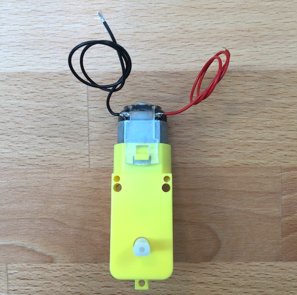

[Home]({{ site.baseurl }}) | [Building]({{ site.baseurl }}) | [Programming]({{ site.baseurl }}) | [Extensions]({{ site.baseurl }})

# Building your robot

## 1. Parts

Check your parts..

You should have the follwing screws:
* M3 x 30mm (4x)
* M3 x 20mm (2x)
* M3 x 10mm (18x)
* M3 x 12mm countersunk (6x)
* plastic screw (2x)

## 2. Soldering

Before we put the robot together, you need to solder a some wires to the motors, as well as the power switch of your robot.

### Motors

There are two copper terminals on each motor. Solder a red wire to the right terminal, and a black wire to the left terminal. Repeat for the other motor.

### Power Switch

The power switch is connected between the positive side of the battery and the motor shield. So you need to solder the red (positive) wire of the battery connector to the switch, and an additional red wire as well. The switch has three tabs, you need to solder one wire to the middle tab, and the other wire to one of the outside tabs.

## 3. Putting everything together

### Motors

Mount the motors to their panels. There are two side panels, one for each motor. Since you can mount the motor from either side, make sure mount one motor to one side of the first panel, and the second motor to the other side of the other panel (as in the picture below).

Use the 30mm bolts to fasten the motors to the panels, having the heads of the bolts on the outside of the panel, and the nuts on the motor, as shown below.

### Bottom ball caster

Take the bottom plate, put the ball caster onto the matching two holes, and screw it together with 2 M3x10mm screws and nuts.

### Ultrasound distance sensor

The ultrasound distance sensor is going to be connected with the 4-pin cable. Since you won't be able to see the connector when plugging the other side of the cable in, take some tape and label the other side of the cable with the names of the pins on the sensor (as shown below). On some sensors, the labels are on the front of the sensor instead.

Next, take the sensor and put it through the eye cutouts of the face plate. The cables should point downwards.

### The power switch

The power switch goes into the back plate, through the circular hole. With the two square holes on the top, the switch should be on the right side of the back panel. Mount it so the swicht goes up and down, not left to right, otherwise the plate don't fit on the rest of the robot.

