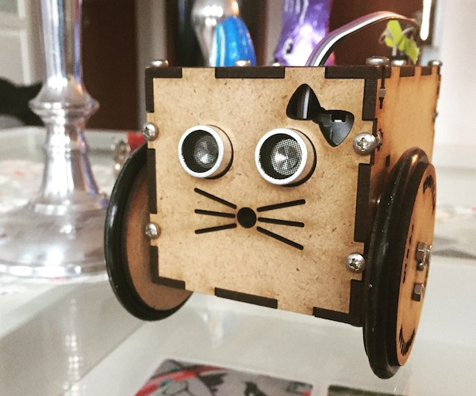

[Home]({{ site.baseurl }}) | [Building]({{ site.baseurl }}) | [Programming]({{ site.baseurl }})

# Pet Robot

A tiny Arduino-based robot platform. Inspired by the Pop Pet Robot.

## PopPet Robot
The PopPet robot was a kickstarter in 2014. It was successful, and the designs were open sourced. And then it sort of died. The website is down, the Facebook page gone, and the twitter account has gone pretty much silent.

* [Original design](https://www.thingiverse.com/thing:706375)
* [Kickstarter](https://www.kickstarter.com/projects/jaidynedwards/poppet-diy-arduino-compatible-open-hardware-robot)
* [Website](http://www.poppettherobot.com/) ([Backup on archive.org](https://web.archive.org/web/20160222195250/http://www.poppettherobot.com/))
* [Twitter](https://twitter.com/PopPetTheRobot)

## Materials
* the body and wheels are lasercut out of 3mm MDF
* motors are these quasi-standard cheap beginner robotics motors, available e.g. at [HobbyKing](https://hobbyking.com/de_de/geared-motor-w-90-deg-shaft-2pcs-bag.html)
* there's an omni-wheel caster in the back, which is probably the same as [this one](https://hobbyking.com/de_de/49x20x32mm-steel-ball-omni-wheel.html)
  * I'd like to replace it with a smaller one to also make the front wheels a bit smaller. [This one](https://hobbyking.com/de_de/50x23x25mm-steel-ball-omni-wheel.html) might be an option.
* Arduino
* Motor Shield: https://www.adafruit.com/product/81
  * The Adafruit v1 Motor Shield is not produced by Adafruit anymore, but there are clones of it available from China. They are much cheaper than any other motor shield available, but work well enough for our purpose.
  * [Documentation](https://learn.adafruit.com/adafruit-motor-shield/overview)
  * [Schematic](https://raw.githubusercontent.com/adafruit/Adafruit-Motor-Shield-for-Arduino/master/mshieldv12schem.png)

## Firmware
### Libraries
* [Adafruit Motor Shield](https://github.com/tiefpunkt/Adafruit-Motor-Shield-library/releases/tag/1.0.1)
  * [Relevent documentation part for controlling DC motors](https://learn.adafruit.com/adafruit-motor-shield/af-dcmotor-class)
* [NewPing](https://bitbucket.org/teckel12/arduino-new-ping/downloads/)

## Notes
* Font for the wheels: [Phat Phreddy](http://www.dafont.com/de/phatt-phreddy.font?text=WOOD+YEAR)

## Newsletter
We finally have a newsletter. Stay updated about all that happens here at PetRobot HQ.

<!-- Begin MailChimp Signup Form -->

<form action="//munichmakerlab.us15.list-manage.com/subscribe/post?u=0e83a25edeba666136a8a268a&amp;id=0e4aeba960" method="post" id="mc-embedded-subscribe-form" name="mc-embedded-subscribe-form" class="validate" target="_blank" novalidate>
    

	<label for="mce-EMAIL">Subscribe right here</label>
	<input type="email" value="" name="EMAIL" class="email" id="mce-EMAIL" placeholder="email address" required> <input type="submit" value="Subscribe" name="subscribe" id="mc-embedded-subscribe" class="button">
    <!-- real people should not fill this in and expect good things - do not remove this or risk form bot signups-->
    
<input type="text" name="b_0e83a25edeba666136a8a268a_0e4aeba960" tabindex="-1" value="">

    

    

</form>

<!-- End MailChimp Signup Form -->
